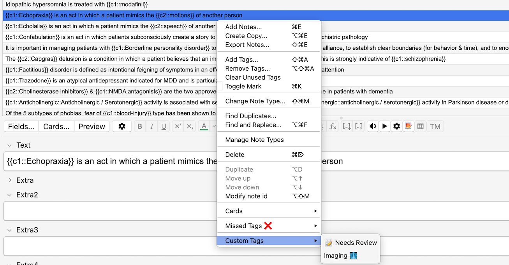

## This add-on was uploaded for <u>SDOY Papa JP</u>

# ~ Friend Pack ~ 

Friend Pack is an Anki Browser add-on focused on faster tag-based review workflows.
It is built around three main tools:

- **Missed Tags** for quickly tagging missed questions and repeat misses
- **Find QIDs** for searching notes by question-bank ID
- **Custom Tags** for adding your own preset tag actions from the right-click menu

## Main Functions

- Adds **QID search** tools for finding notes tagged with question-bank IDs
- Adds two **tagging submenus** in the Browser right-click menu

### 
- Supports source-specific tagging for **UWorld**, **NBME**, and **Amboss**
- Supports repeat-miss tagging such as **2x Missed**
- Supports marking cards as **Guessed Correct**
- Supports custom extra sources through an **Other** submenu
- Adds a **Custom Tags** submenu for your own saved tag presets
- Lets you rename menu labels and adjust tag roots to fit your own workflow

## Designed for tag-based review

Friend Pack is most useful if you organize Anki notes around missed questions, question-bank sources, and review-state tags.
The default setup is built around a structured missed-question system using a primary tag such as:

```text
##Missed-Qs
```

From that root, Friend Pack can build more specific child tags for sources like UWorld, NBME, Amboss, and other custom review resources.

## Example workflow

With the default configuration, right-clicking selected notes in the Browser gives quick actions like:

- **♦️ Base**
- **🗺️ UW*rld**
- **🧠 NBME**
- **🦠 Amb*ss**
- **2x Missed 📌**
- **Guessed Correct 🎫**
- **Other** submenu for other Qbank resources

Example tags created by default may look like:

```text
##Missed-Qs
##Missed-Qs::UW_Tests::...
##Missed-Qs::NBME::...
##Missed-Qs::2x::...
#Custom::correct_marked
```

<div >

</div>

## Custom Tags bonus menu

Friend Pack also includes a lightweight **Custom Tags** menu for users who want fast preset tagging actions without manually typing tags each time.
This is useful for personal workflow tags such as:

```text
#Custom::Review
#Custom::Imaging
```

## Configurable

Most users only need small config changes.
The add-on can be customized to:

- Rename the Browser menu title
- Rename the Missed Tags submenu
- Change the primary missed-question tag root
- Change source tag segments for UWorld, NBME, and Amboss
- Set a QID parent tag for search
- Choose whether QID search defaults to missed-only mode
- Add your own custom preset tag actions

## Good fit for users who:

- Review missed questions in Anki after doing Q-banks
- Want quicker tagging from the Browser right-click menu
- Want a cleaner workflow for missed-question tracking and QID lookup

## This add-on was uploaded for <u>SDOY Papa JP</u>
